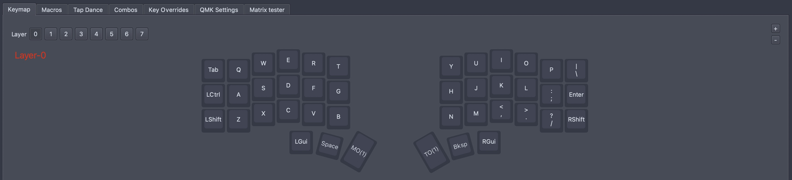
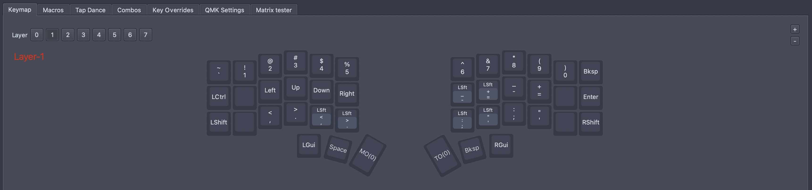
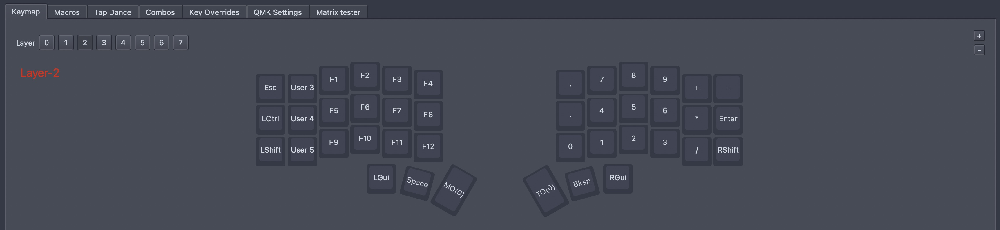

# Cygnus-Keymap

My cygnus keymap, 3x6 keys + 3 thumb keys.

  
  

## Layers

The keymap is based on the standard qwerty layout, which I am used to. The layout is edited with: <https://get.vial.today/>. I set 3 layers for alphabet keys, number/punctuation keys and F/numpad keys.

#### Layer-0

#### Layer-1

#### Layer-2

## Special Keys

#### Layer Keys

There are 3 special keys to switch between different layers: `MO(x)` on the left thumb, `TO(x)` and `User x` on the right thumb.

- To momentarily typing some symbols/numbers/etc, press `MO(x)` to switch to other layers, then release it to go back to default layer-0.
- To long time typing symbols/numbers/etc, press `TO(x)` to go to other layers and done the work, then press `TO(x)` to go back to default layer-0.

#### Combos

There are some more combos for fast editing:

- `ESC` combo: `Q`+`W` in layer-0, `1`+`2` in layer-1.
- `(`/`)` combo: `R`+`T`/`Y`+`U` in layer-0, `4`+`5`/`6`+`7` in layer-1.
- `[`/`]` combo: `F`+`G`/`H`+`J` in layer-0, `Down`+`Right`/`_`+`+` in layer-1.
- `{`/`}` combo: `V`+`B`/`N`+`M` in layer-0, `<`+`>`/`:`+`"` in layer-1.
