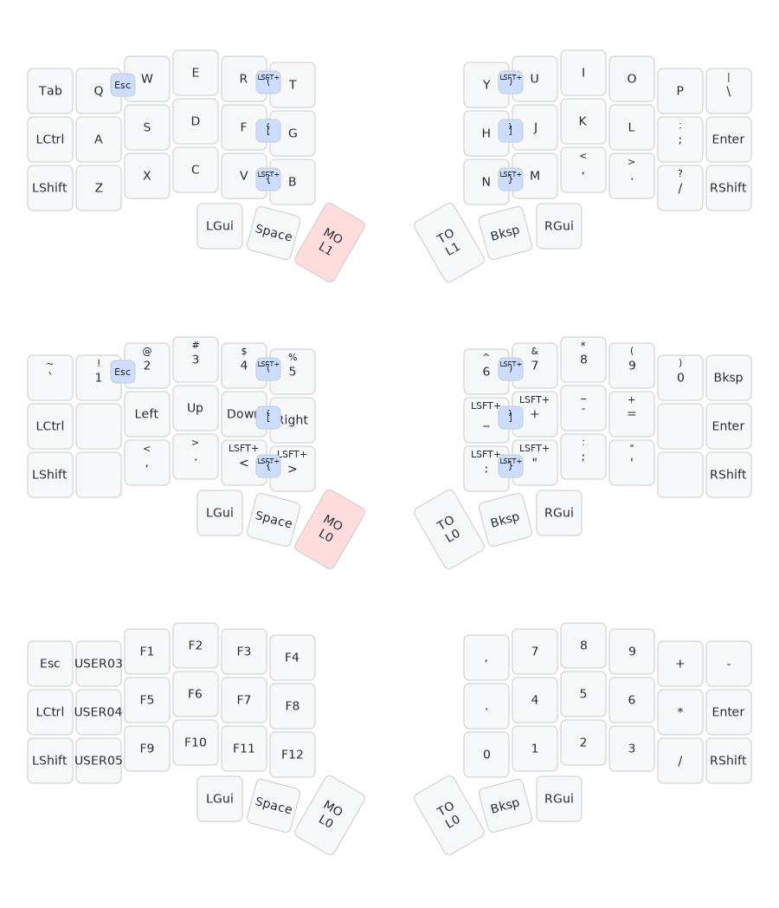

# Cygnus-Keymap

My cygnus keymap, 3x6 keys + 3 thumb keys.

  
  

## Layers

The keymap is based on the standard _**QWERTY**_ layout, which I am used to. Three layers are been created:

- L0: Alphabet keys and some keys around them (`ctrl`, `cmd`, `enter`, etc).
- L1: Symbol (`-`, `=`, `,`, `"`, etc), number (`1`-`9`) and navigation (`Up`, `Down`, `Left`, `Right`) keys around the alpha keys.
- L2: Function (`F1`-`F12`), numpad (`1`-`9`, `+`, `-`, `.`, etc) and other keys.

## Special Keys

There are 2 special keys to switch between different layers: `MO(x)` on the left thumb, `TO(x)` on the right thumb.

- To momentarily typing some symbols/numbers/etc, press `MO(x)` to switch to other layers, then release it to go back to default layer-0.
- To long time typing symbols/numbers/etc, press `TO(x)` to go to other layers and done the work, then press `TO(x)` to go back to default layer-0.

## Generate Keymap Layout

1. Create the keymap by [Vial](https://get.vial.today/), and save the firmware into the `Cygnus-Keymap.vil` file.
2. Use the [Vial layout to Keymap Drawer converter](https://yal-tools.github.io/vial-to-keymap-drawer/) to convert the `Cygnus-Keymap.vil` file to `Cygnus-Keymap.yml` file. Note: Choose _**Keyboard Kind**_ as `splitkb/aurora/corne/rev1` , choose _**Layout Name**_ as `LAYOUT_split_3x6_3`. Because it is the closest keyboard from all of the qmk layouts.
3. Open the `Cygnus-Keymap.yml` file and delete all the `- -1` items in `layers`, to fix the incompatible issue with the qmk layout.
4. Paste the contents of the `Cygnus-Keymap.yml` to the _**Keymap YAML**_ part of [Keymap Drawer](https://keymap-drawer.streamlit.app/), click the _**Run**_ button, then we have the generated keymap image.
